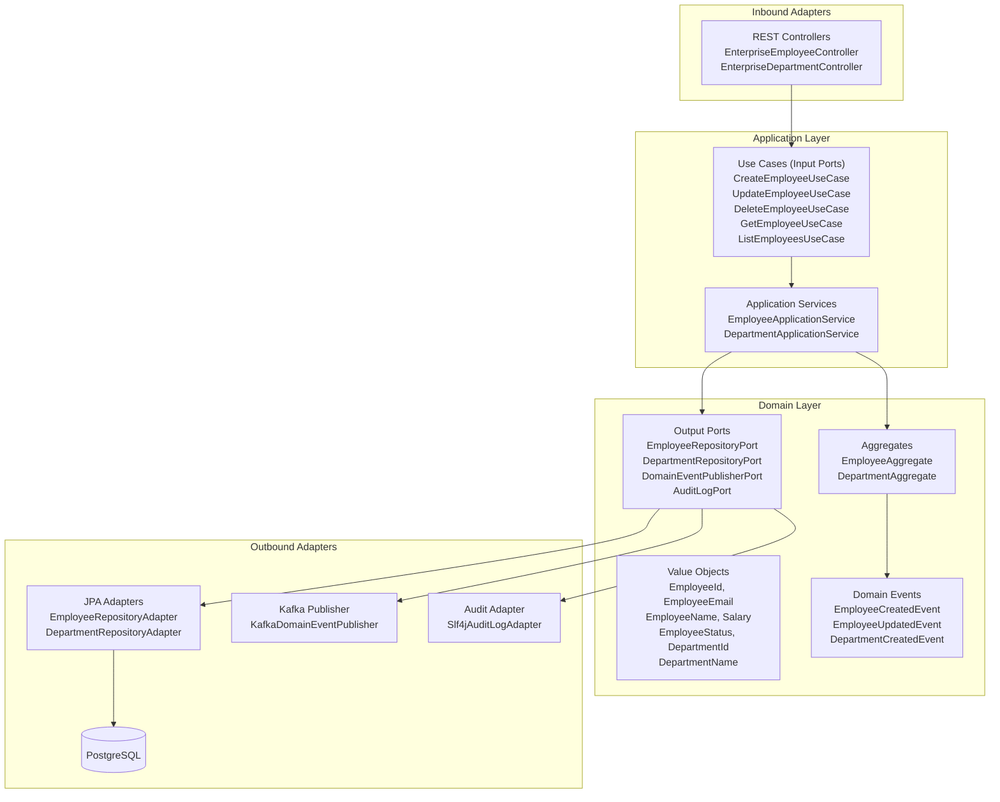
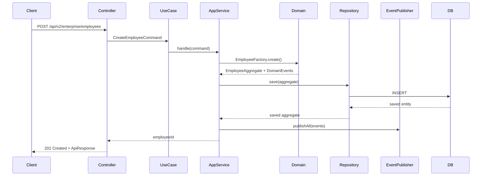
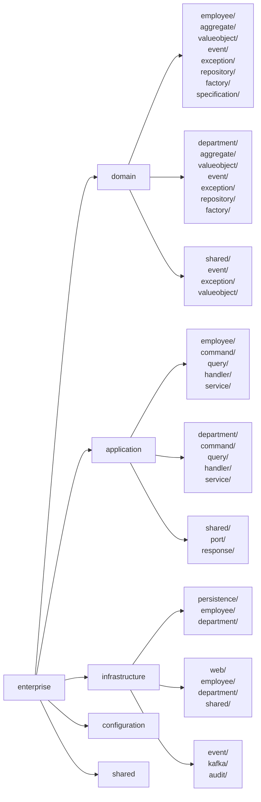
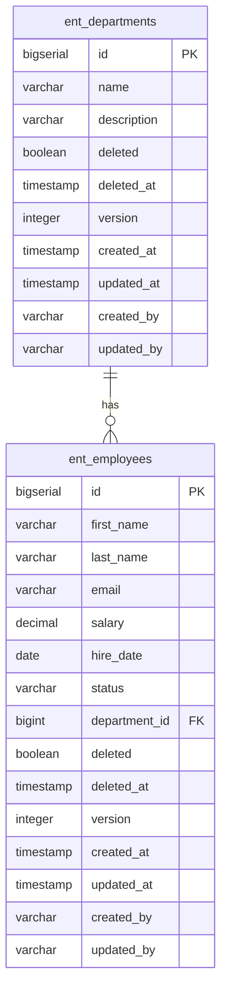

# Architecture Diagrams

## Hexagonal Architecture

```mermaid
graph TB
    subgraph "Inbound Adapters"
        REST["REST Controllers\nEnterpriseEmployeeController\nEnterpriseDepartmentController"]
    end

    subgraph "Application Layer"
        UC["Use Cases (Input Ports)\nCreateEmployeeUseCase\nUpdateEmployeeUseCase\nDeleteEmployeeUseCase\nGetEmployeeUseCase\nListEmployeesUseCase"]
        AS["Application Services\nEmployeeApplicationService\nDepartmentApplicationService"]
    end

    subgraph "Domain Layer"
        AGG["Aggregates\nEmployeeAggregate\nDepartmentAggregate"]
        VO["Value Objects\nEmployeeId, EmployeeEmail\nEmployeeName, Salary\nEmployeeStatus, DepartmentId\nDepartmentName"]
        EVT["Domain Events\nEmployeeCreatedEvent\nEmployeeUpdatedEvent\nDepartmentCreatedEvent"]
        PORTS["Output Ports\nEmployeeRepositoryPort\nDepartmentRepositoryPort\nDomainEventPublisherPort\nAuditLogPort"]
    end

    subgraph "Outbound Adapters"
        JPA["JPA Adapters\nEmployeeRepositoryAdapter\nDepartmentRepositoryAdapter"]
        KAFKA["Kafka Publisher\nKafkaDomainEventPublisher"]
        AUDIT["Audit Adapter\nSlf4jAuditLogAdapter"]
        DB[(PostgreSQL)]
    end

    REST --> UC
    UC --> AS
    AS --> AGG
    AS --> PORTS
    AGG --> EVT
    PORTS --> JPA
    PORTS --> KAFKA
    PORTS --> AUDIT
    JPA --> DB
```

## CQRS Flow

```mermaid
sequenceDiagram
    participant Client
    participant Controller
    participant UseCase
    participant AppService
    participant Domain
    participant Repository
    participant EventPublisher
    participant DB

    Client->>Controller: POST /api/v2/enterprise/employees
    Controller->>UseCase: CreateEmployeeCommand
    UseCase->>AppService: handle(command)
    AppService->>Domain: EmployeeFactory.create()
    Domain-->>AppService: EmployeeAggregate + DomainEvents
    AppService->>Repository: save(aggregate)
    Repository->>DB: INSERT
    DB-->>Repository: saved entity
    Repository-->>AppService: saved aggregate
    AppService->>EventPublisher: publishAll(events)
    AppService-->>Controller: employeeId
    Controller-->>Client: 201 Created + ApiResponse
```

## Package Structure

```mermaid
graph LR
    enterprise --> domain
    enterprise --> application
    enterprise --> infrastructure
    enterprise --> configuration
    enterprise --> shared

    domain --> employee_domain["employee/\n  aggregate/\n  valueobject/\n  event/\n  exception/\n  repository/\n  factory/\n  specification/"]
    domain --> department_domain["department/\n  aggregate/\n  valueobject/\n  event/\n  exception/\n  repository/\n  factory/"]
    domain --> shared_domain["shared/\n  event/\n  exception/\n  valueobject/"]

    application --> employee_app["employee/\n  command/\n  query/\n  handler/\n  service/"]
    application --> department_app["department/\n  command/\n  query/\n  handler/\n  service/"]
    application --> shared_app["shared/\n  port/\n  response/"]

    infrastructure --> persistence["persistence/\n  employee/\n  department/"]
    infrastructure --> web["web/\n  employee/\n  department/\n  shared/"]
    infrastructure --> events["event/\n  kafka/\n  audit/"]
```

## Domain Model (ER)

```mermaid
erDiagram
    ent_departments {
        bigserial id PK
        varchar name
        varchar description
        boolean deleted
        timestamp deleted_at
        integer version
        timestamp created_at
        timestamp updated_at
        varchar created_by
        varchar updated_by
    }

    ent_employees {
        bigserial id PK
        varchar first_name
        varchar last_name
        varchar email
        decimal salary
        date hire_date
        varchar status
        bigint department_id FK
        boolean deleted
        timestamp deleted_at
        integer version
        timestamp created_at
        timestamp updated_at
        varchar created_by
        varchar updated_by
    }

    ent_departments ||--o{ ent_employees : "has"
```
